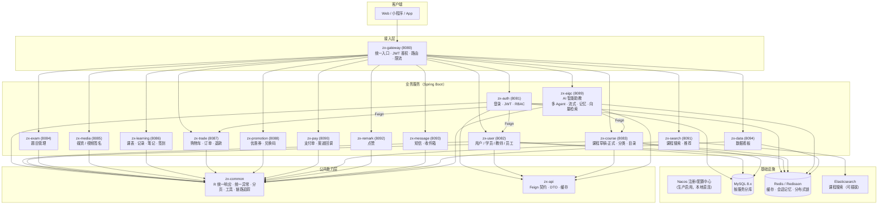
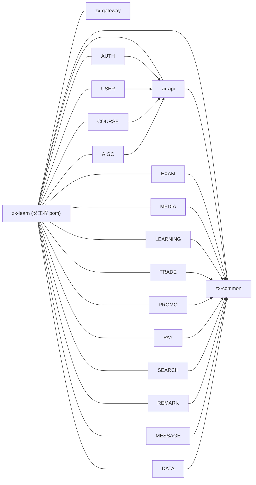
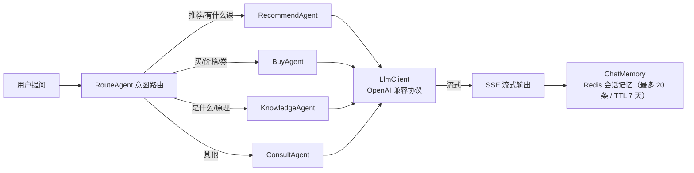

# 知行智学（ZhiXing Learn / zx-learn）架构设计

> 版本：v1.0 · 文档状态：持续维护
> 关联文档：[README](../README.md) · [接口参考](API-REFERENCE.md) · [数据库设计](DATABASE.md) · [部署指南](DEPLOYMENT.md)

---

## 1. 项目定位

**知行智学**是一个面向在线教育场景的 **AI 驱动的微服务学习平台**，覆盖课程学习、交易支付、营销优惠、互动社区与 **AI 智能助教** 五大业务域。

- 语言：Java 21
- 基础框架：Spring Boot 3.3.5
- 微服务：Spring Cloud / Spring Cloud Alibaba 2023.0.3
- 构建：Maven 多模块（17 个模块）
- 部署形态：Docker（提供通用 Dockerfile 与一键启动脚本）

## 2. 总体架构图

## 3. 模块依赖关系

> 设计原则：
> 1. **zx-common 是公共底座**，任何业务模块都依赖它，但它不依赖任何业务模块（无循环依赖）。
> 2. **zx-api 是跨服务契约层**，只放 Feign Client / DTO / 缓存定义，避免服务间直接依赖对方内部类。
> 3. **zx-gateway 是纯 WebFlux 网关**，刻意不依赖 zx-common/zx-api，保持轻量与响应式（servlet 与 reactive 体系隔离）。

## 4. 核心设计

### 4.1 统一响应 `R<T>`

所有对外接口返回 `{ code, msg, data, requestId }`：

- `WrapperResponseBodyAdvice`（ResponseBodyAdvice）自动将 Controller 返回值包装为 `R<T>`。
- `@NoWrapper` 注解可跳过包装，用于 SSE 流式接口与 Feign 内部接口（内部接口不需要 R 外壳）。
- String 类型返回值会先序列化再包装，避免类型转换错误。

### 4.2 统一异常处理

`CommonExceptionAdvice`（@RestControllerAdvice）集中处理：

| 异常类型 | HTTP 语义 | 日志级别 |
|---|---|---|
| UnauthorizedException | 401 未登录 | warn |
| ForbiddenException | 403 无权限 | warn |
| BadRequestException | 400 参数错误 | warn |
| BizIllegalException | 业务规则不满足 | warn |
| DbException | 数据库异常 | error |
| RequestTimeoutException | 超时 | warn |
| MethodArgumentNotValidException / BindException | 参数校验失败 | warn |
| Exception | 兜底未知异常 | error |

### 4.3 请求链路追踪（requestId）

- `RequestIdInterceptor` 在请求入口生成/读取 `requestId`，写入 MDC。
- `RequestIdRelayConfiguration` 通过 Feign 请求拦截器将 `requestId` 透传到下游服务。
- 统一响应 `R.requestId` 携带该值，配合日志 MDC 即可全链路串联排查。

### 4.4 鉴权链路（JWT + Gateway + RBAC）

1. 客户端携带 `Authorization: Bearer <token>` 访问网关。
2. `AuthGlobalFilter`（GlobalFilter，order=-100）：
   - 白名单路径（登录/刷新/文档等）直接放行；
   - 校验 JWT 有效性，无效返回 401；
   - 解析 userId 写入 `user-info` 请求头透传下游。
3. 下游服务通过 `UserInfoInterceptor` 解析 `user-info` 头，写入 `UserContext`（ThreadLocal）。
4. RBAC：auth 服务维护 `role / menu / privilege` 及关联表，支持菜单权限与 API 路径权限。

### 4.5 课程草稿-正式双表

- 编辑过程只写 `course_draft` 草稿表，支持反复修改不影响线上。
- 上架（upShelf）时校验完整性（名称/分类/价格/教师）后同步到正式表 `course`。
- 每次上架 `publishTimes + 1`，记录发布次数。

### 4.6 AI 多 Agent 智能助教（zx-aigc）

- `AbstractAgent` 定义统一行为（`type() / stream() / answer()`），新增 Agent 只需继承并实现。
- `LlmClient` 调用 OpenAI 兼容接口（可对接 DeepSeek / 通义千问等）；未配置 apiKey 时返回模拟回复，保证本地可跑。
- 向量检索与语音接口（`EmbeddingController` / `AudioController`）为可插拔能力，默认走本地降级。

### 4.7 骨架模块与完整模块

- **完整实现**（✅）：zx-common、zx-api、zx-gateway、zx-auth、zx-user、zx-course、zx-aigc —— 含数据库持久化、完整业务校验与异常处理。
- **骨架实现**（🔶）：zx-exam、zx-media、zx-learning、zx-trade、zx-promotion、zx-pay、zx-search、zx-remark、zx-message、zx-data —— 接口契约与控制器已就绪，核心逻辑用**内存存储**（ConcurrentHashMap）演示，可直接替换为 DB/Redis 持久化。这是刻意为之的渐进式设计，方便逐步扩展。

## 5. 技术选型与理由

| 选型 | 理由 |
|---|---|
| Spring Boot 3.3.5 | 稳定主线版本，Jakarta EE 9+，内置可观测性 |
| Spring Cloud Alibaba | Nacos 服务发现/配置、Seata 分布式事务（预留）、Sentinel 限流（预留） |
| OpenFeign + LoadBalancer | 声明式服务调用，配合请求拦截器实现链路透传 |
| MyBatis-Plus 3.5.9 | 单表 CRUD 零 SQL，分页插件、逻辑删除、字段自动填充开箱即用 |
| JWT（jjwt 0.12.6） | 无状态鉴权，网关统一校验，双 Token（access + refresh） |
| Redis / Redisson | 缓存、AI 会话记忆、分布式锁（Redisson） |
| Spring AI 1.0.0-M6 + 自研多 Agent | 演示 LLM 集成能力，同时保留对主流 OpenAI 兼容服务的适配空间 |
| Knife4j 4.5.0 | 基于 OpenAPI3 的在线接口文档 |
| Docker | 通用 Dockerfile + startup.sh，一键容器化部署 |

## 6. 服务端口一览

| 服务 | 端口 | 服务 | 端口 |
|---|---|---|---|
| gateway | 8080 | trade | 8087 |
| auth | 8081 | promotion | 8088 |
| user | 8082 | aigc | 8089 |
| course | 8083 | pay | 8090 |
| exam | 8084 | search | 8091 |
| media | 8085 | remark | 8092 |
| learning | 8086 | message | 8093 |
| data | 8094 | | |

## 7. 演进路线（Roadmap）

- [ ] 骨架模块数据库持久化（learning/trade/promotion/pay 优先）
- [ ] Nacos 注册中心 + 配置中心切换（生产）
- [ ] Seata 分布式事务（下单 + 扣券 + 支付回调一致性）
- [ ] Sentinel 限流/熔断
- [ ] Elasticsearch 课程搜索接入
- [x] AI 助手接入 pgvector 实现知识库 RAG（500/50 滑窗切片 + Top3 阈值检索 + 来源溯源）；课程推荐 Function Calling 查真实课程库
- [ ] 向量库规模化演进：pgvector → Milvus（数据量上亿 / 多副本高可用时）
- [ ] 前端 Web / 小程序端联调
