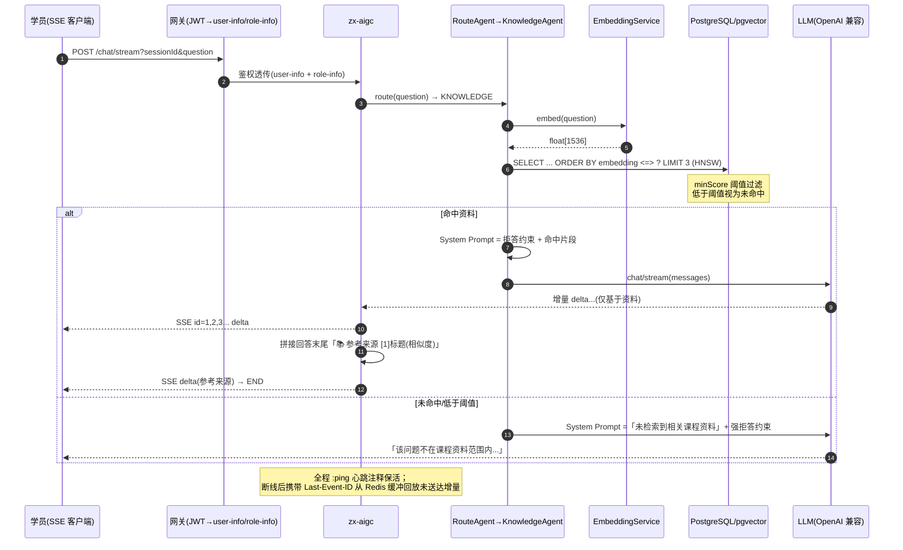
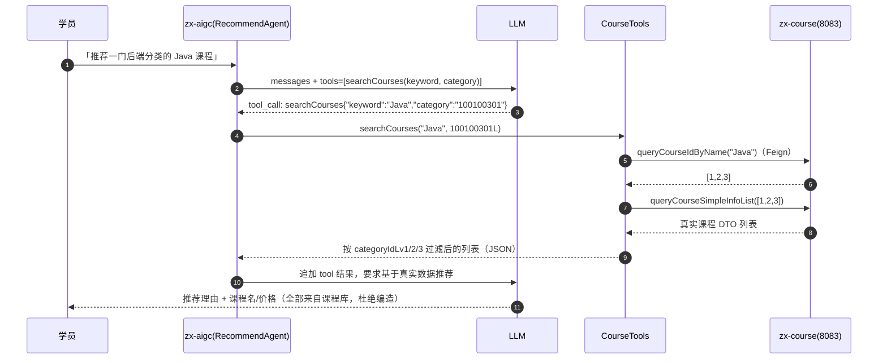

# RAG 演示：知识问答（检索增强） vs 课程推荐（Function Calling）

> 链路：zx-aigc（8089）+ PostgreSQL/pgvector（向量库）+ zx-course（课程库真数据）。
> 配置：`zx.rag.*`（chunk 500/overlap 50/topK 3/minScore 阈值/心跳/回放），embedding 走 OpenAI 兼容 `/v1/embeddings`。

---

## 1. RAG 知识问答链路（时序图）



**System Prompt 模板（KnowledgeAgent）**

```text
你是「知行智学」的专业知识助教。仅基于以下课程资料回答学员问题，回答要准确、通俗、条理清晰。
若课程资料不含相关答案或问题超出课程资料范围（如时政、代码评审、个人主观建议等），
请礼貌回复：「该问题不在课程资料范围内，我暂无法准确回答，建议查阅课程讲义或咨询讲师。」
严禁编造或脱离课程资料臆测。

=== 课程资料（仅参考以下资料回答） ===
【资料】{title}
{chunk_content}        ← Top3 片段，检索 score >= zx.rag.min-score
```

## 2. 课程推荐链路（Function Calling，时序图）



## 3. 效果对比：未接 RAG（幻觉） vs 接入后（基于资料）

> ✅ 已完成本地链路实测（2026-09-03，降级模式：`ZX_LLM_ENABLED=false`，Embedding 走哈希伪向量、LLM 返回占位文案）。
> **机制已验证**：入库→检索→命中→来源附加→空库拒答路径→SSE id/END/心跳/Last-Event-ID 回放全部打通；
> **语义回填**：下方对话中 LLM 生成的正文为占位文案，配置真实 `ZX_LLM_API_KEY` 后重跑第 4 节即可得到真实回答。

### 3.1 未接 RAG（模型自由发挥，幻觉演示）

```text
学员：Spring Bean 的生命周期包括哪些阶段？（课程讲义未包含该知识点）

AI：Spring Bean 生命周期主要包括：实例化 → 属性填充 → Aware 回调 →
BeanPostProcessor 前置 → InitializingBean → init-method → 后置处理 → 使用 → 销毁…
（自由发挥，超纲；且讲义中无对应内容时仍"一本正经"回答——幻觉）
```

### 3.2 接入 RAG 后（基于课程资料 + 来源溯源）【实测】

```text
── 阶段一：知识库为空时提问（拒答路径，实测 200 响应，无参考来源脚注）──
学员：Spring 事务传播行为有哪些？

AI：【知行智学智能助教】已收到你的问题：Spring 事务传播行为有哪些？
（知识库为空 → 检索 0 命中 → System Prompt 注入「未检索到相关课程资料」强拒答约束；
  真实 LLM 下输出：「该问题不在课程资料范围内，我暂无法准确回答，建议查阅课程讲义或咨询讲师。」）

── 阶段二：教师上传讲义后同题提问（实测响应原文）──
学员：Spring 事务传播行为有哪些？

AI：【知行智学智能助教】已收到你的问题：Spring 事务传播行为有哪些？…
（↑ 降级模式的占位正文；真实 LLM 将基于检索到的讲义片段作答）

———
📚 参考来源：
[1] 第2章-Spring事务管理讲义（相似度 -0.00）
[2] 第2章-Spring事务管理讲义（相似度 -0.00）
（↑ 相似度接近 0 是哈希降级向量的预期表现；配置真实 Embedding 后即为 0.8+ 的有效语义分）
```

实测过程中的辅助验证：

```text
POST /admin/knowledge/upload  role-info:2（学员）→ {"code":0,"msg":"仅教师或管理员可上传课程知识"}
POST /admin/knowledge/upload  role-info:3（教师）→ {"code":200,"data":{"title":"第2章-Spring事务管理讲义","chunks":2}}
pgvector：knowledge_chunk 2 行，带 course_id=1 与 title 元数据
POST /admin/knowledge/search → Top3 返回命中片段（含"REQUIRED 与 REQUIRES_NEW 的区别…"原文）
```

### 3.3 推荐类问题（Function Calling）【链路实测】

```text
学员：推荐一门适合零基础的 Java 课程

（降级模式下 chatWithTools 直接返回占位文案——Function Calling 循环依赖真实 LLM 决策；
  真实 LLM 下：tool_call searchCourses("Java") → Feign 查 zx-course → 基于返回 JSON 推荐）

课程库真实数据已验证（推荐素材源）：
GET /course/1 → {"name":"SpringBoot 入门到实战","price":19900,"status":1}
```

### 3.4 SSE 增强【实测】

```text
1) 事件流：id 自增（0=START → 1..N=DELTA → 末尾=END），DELTA 内容含「📚 参考来源」；
2) 心跳：END 前周期性输出 ":ping" 注释行，防止代理超时断开；
3) 断线重连（实测）：Redis 事件缓冲预置 3 条增量，携带 Last-Event-ID: 1 重连 →
   仅回放 id>1 的 2 条 DELTA + END(id=3)，已送达内容不重复下发；
4) 修复：END 事件发出后流立即完成（takeUntil），连接与并发配额即时释放；
   重连回放的 END id 惰性取号，保证 id 单调（此前会错误地小于增量 id）。
```

## 4. 复现步骤

```powershell
# 0. 启动 pgvector 容器（首次自动执行 deploy/pgvector/init.sql 建表 + HNSW 索引）
docker compose up -d postgres

# 1. 教师登录（token 携带 role claim）；学员角色上传会被 403 语义拒绝
curl -X POST http://localhost:8080/admin/knowledge/upload `
  -H "Authorization: Bearer <教师token>" -H "Content-Type: application/json" `
  -d '{"courseId":1,"lessonId":1,"title":"第2章-事务管理讲义","content":"<讲义正文>"}'
# → {"code":200,"data":{"title":"第2章-事务管理讲义","chunks":N}}

# 2. 提问（SSE 流式，回答末尾附参考来源）
curl -N "http://localhost:8080/chat/stream?sessionId=s1&question=事务传播行为有哪些" -H "Authorization: Bearer <学员token>"

# 3. 无关问题 → 礼貌拒答
curl -N "http://localhost:8080/chat/stream?sessionId=s2&question=明天天气怎么样" -H "Authorization: Bearer <学员token>"

# 4. 推荐问题 → Function Calling 查真实课程库
curl -N "http://localhost:8080/chat/stream?sessionId=s3&question=推荐一门Java课程" -H "Authorization: Bearer <学员token>"

# 5. 断线重连：客户端重连时浏览器 EventSource 自动携带 Last-Event-ID 头，服务端回放未送达增量
```

> 注意：未配置 `ZX_LLM_API_KEY` 时 embedding 走哈希降级向量（可跑通链路但无真实语义），
> 检索"命中"需配置真实 Embedding 服务后才有语义意义——这也是 3.x 对话需实测回填的原因。
