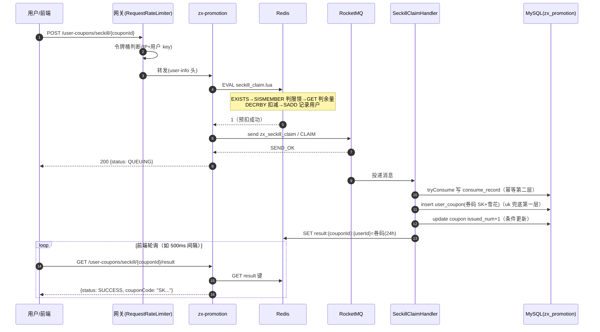
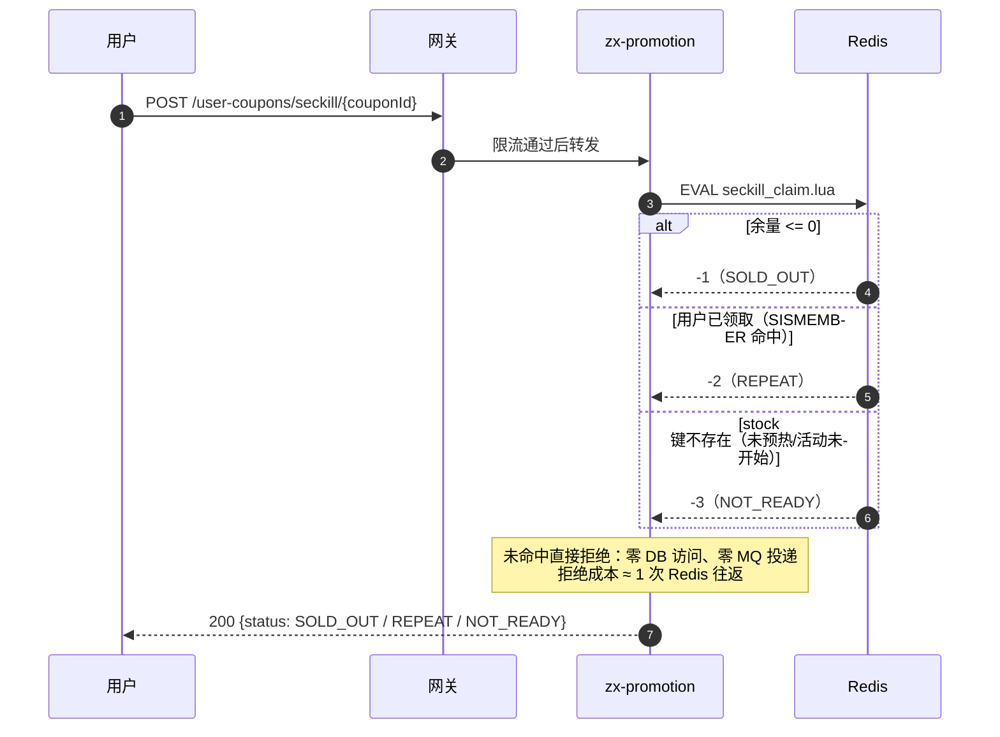
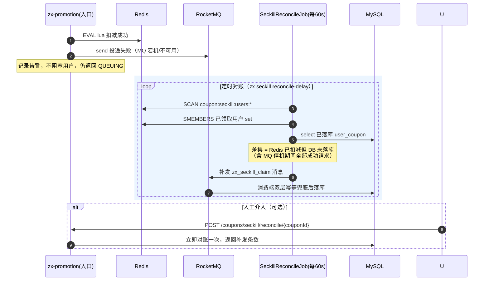

# 优惠券秒杀链路设计（Redis Lua 预扣 + MQ 异步落库）

> 模块：zx-promotion（8088）+ zx-gateway（8080）限流；依赖 RocketMQ 基建（`zx-common` 统一封装）。
> 目标：500 并发下**无超发**（DB 券码数 = Redis 扣减数）、**无重复领取**；MQ 停机重启后自动补投。

---

## 1. 整体架构

```
请求 → 网关(IP+用户 令牌桶限流) → 秒杀入口
     → Redis Lua 原子预扣（限领判重 + 余量判断 + 扣减 + 记录用户，单次网络往返）
     → 成功则投递 MQ，立即返回「排队中」
     → 消费端异步落库（消费流水幂等 + uk_user_coupon 兜底），写结果键
     → 前端轮询结果接口拿券码
     → 定时对账（Redis users set vs DB 领取记录差集补发）+ 手动补偿接口
```

### Redis Key 规范（与 zx-trade 核销预扣的 `coupon:stock` 系列相互独立）

| Key | 类型 | 用途 |
|---|---|---|
| `coupon:seckill:stock:{couponId}` | string | 秒杀余量（活动预热时 SETNX 写入，防覆盖已抢量） |
| `coupon:seckill:users:{couponId}` | set | 已领取用户（限领判重 + 对账依据） |
| `coupon:seckill:result:{couponId}:{userId}` | string | 落库结果（券码 / FAILED / REPEAT，24h 过期，供轮询） |

### Lua 脚本（`zx-promotion/src/main/resources/lua/seckill_claim.lua`）

```lua
-- KEYS[1] = 秒杀余量 key：coupon:seckill:stock:{couponId}
-- KEYS[2] = 已领取用户 set：coupon:seckill:users:{couponId}
-- ARGV[1] = 用户 id
-- ARGV[2] = 每人限领数量
-- 返回： 1=成功  -1=已售罄  -2=重复领取(超限领)  -3=未预热(活动未开始)
if redis.call('EXISTS', KEYS[1]) == 0 then
    return -3
end
if redis.call('SISMEMBER', KEYS[2], ARGV[1]) == 1 then
    return -2
end
local remain = tonumber(redis.call('GET', KEYS[1]))
if remain <= 0 then
    return -1
end

redis.call('DECRBY', KEYS[1], 1)
redis.call('SADD', KEYS[2], ARGV[1])
return 1
```

要点：**单 Lua 单线程原子执行**，限领判重、余量判断、扣减、记录用户四步无并发缝隙；
未命中（售罄/重复/未预热）直接拒绝，**零 DB 访问、零 MQ 投递**。

## 2. 接口清单（SeckillController）

| 接口 | 说明 |
|---|---|
| `POST /user-coupons/seckill/{couponId}` | 秒杀领取，返回 `QUEUING / SOLD_OUT / REPEAT / NOT_READY`（网关限流） |
| `GET /user-coupons/seckill/{couponId}/result` | 轮询结果：`QUEUING / SUCCESS(含券码) / REPEAT / FAILED`（Redis 结果键优先，DB 兜底） |
| `POST /coupons/seckill/warmup/{couponId}` | 活动预热：余量写入 Redis（SETNX，重复调用安全） |
| `POST /coupons/seckill/reconcile/{couponId}` | 手动补偿：立即对账一次，返回补发条数 |

## 3. 可靠性与幂等设计

| 环节 | 机制 |
|---|---|
| Redis 预扣 → MQ 投递失败 | 不阻塞用户（仍返回 QUEUING），对账任务按差集自动补发 |
| MQ 消费幂等（第一层） | `uk_user_coupon(user_id, coupon_id)` 唯一索引，重复消息 insert 冲突 → 写 `REPEAT` 结果 |
| MQ 消费幂等（第二层） | `consume_record` 消费流水表（`consume_key = seckill:claim:{couponId}:{userId}`），与业务同事务 |
| 确定性失败 | 券不存在（被删/下架清库）直接写 `FAILED` 结果，不重投 |
| 券码全局唯一 | `SK + 雪花 ID`，`uk_coupon_code` 唯一索引兜底 |
| 发放数统计 | `issued_num < total_num` 条件更新防并发丢更新；统计漂移由对账校正 |
| MQ 停机重启 | 停机期间预扣成功的用户留在 users set；重启后对账任务扫描差集自动补投落库（验收路径见 §6） |

## 4. 网关防刷（IP + 用户 维度限流）

基于 Spring Cloud Gateway 内置 `RequestRateLimiter`（Redis 令牌桶，redis-reactive）：

- `SeckillKeyResolver`：key = `rate:seckill:{ip}:{userId}`，双维度组合——未登录按 IP、同一用户换 IP 也独立成桶；
- `seckill-claim` 路由（`Path=/user-coupons/seckill/*` + `Method=POST`，置于 promotion 路由之前）：
  `replenishRate=5 / burstCapacity=10 / requestedTokens=1`（单用户 5 QPS、突发 10）；
- 轮询接口（GET，两级路径）不走限流路由，由 promotion-service 正常响应；
- Sentinel（服务级熔断降级）规划中，见 [ROADMAP.md](ROADMAP.md)。

## 5. 时序图

### 5.1 正常路径（预扣成功 → 异步落库 → 轮询拿券码）



### 5.2 库存不足路径（未命中直接拒绝）



### 5.3 消息失败补偿路径（MQ 停机 → 重启后自动补投）



## 6. 验收步骤

1. **预热**：`POST :8088/coupons/seckill/warmup/{couponId}`（total_num 设小于压测请求数，制造售罄场景）。
2. **压测**：`perf-test/run-perf.ps1 -Scenario 4`（阶梯 50/100/200/500，脚本见 `perf-test/jmeter/scenario4-seckill-claim.jmx`）。
3. **无超发校验**：

```sql
-- DB 券码数应 = Redis 扣减数（SCARD），且 <= total_num
SELECT COUNT(*), COUNT(DISTINCT coupon_code) FROM zx_promotion.user_coupon WHERE coupon_id = {couponId};
SELECT COUNT(*) FROM zx_promotion.consume_record WHERE consume_key LIKE 'seckill:claim:{couponId}:%';
```

```redis
SCARD coupon:seckill:users:{couponId}   -- 应与 DB COUNT 一致
GET coupon:seckill:stock:{couponId}     -- total_num - 成功领取数
```

4. **无重复领取**：`SELECT user_id, COUNT(*) FROM zx_promotion.user_coupon WHERE coupon_id={couponId} GROUP BY user_id HAVING COUNT(*)>1;` 应为空（uk 兜底）。
5. **MQ 停机补投**：停掉 NameServer/Broker → 压测秒杀（全部 QUEUING，投递失败告警）→ 重启 MQ → 等待对账周期（默认 60s）→ 重复步骤 3 校验券码数对齐。

压测结果记录于 [PERF.md](PERF.md) 第 4 节。
