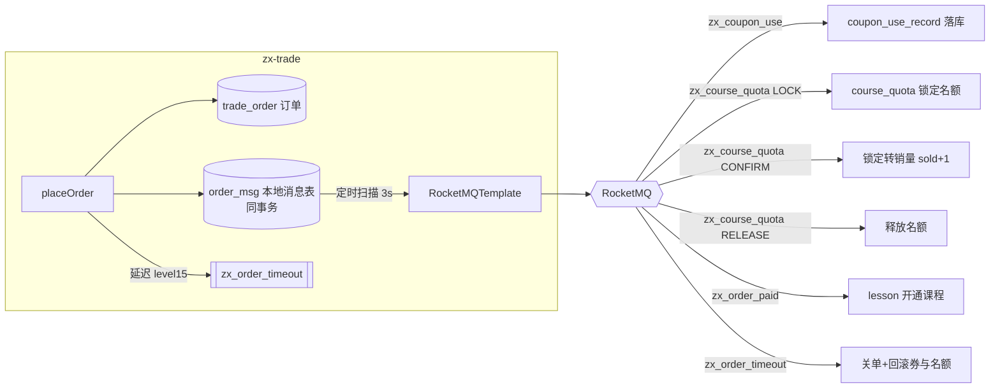
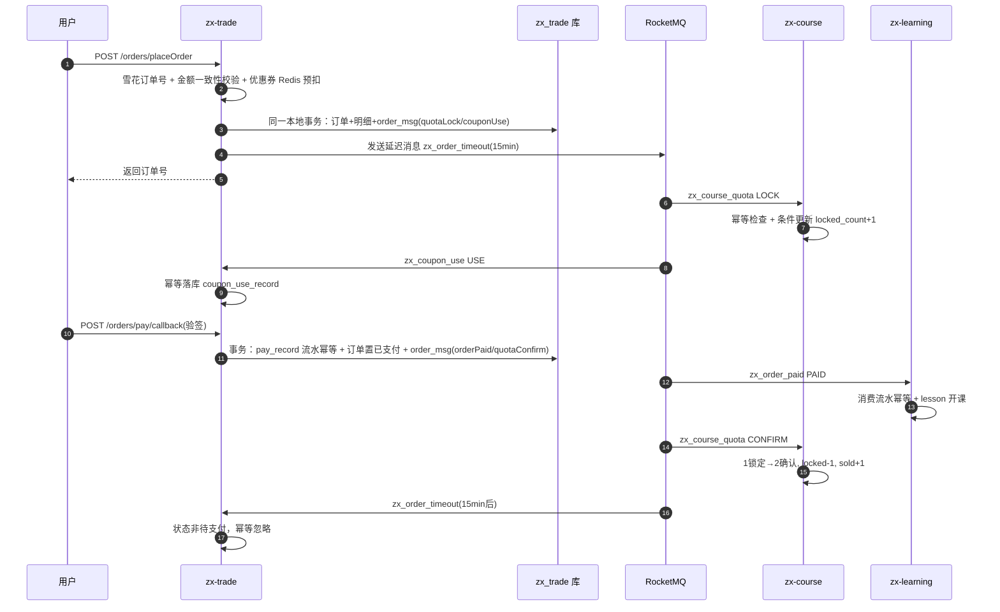
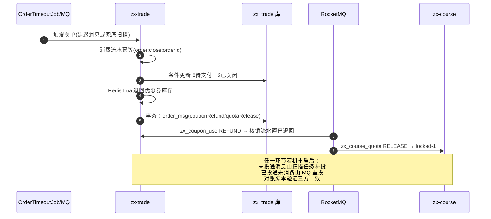

# 交易链路最终一致性设计（本地消息表 + RocketMQ）

> 模块：zx-trade（订单）/ zx-promotion（优惠券）/ zx-course（名额）/ zx-learning（开课）
> 方案：**本地消息表（Transactional Outbox）+ MQ 异步事件 + 双层消费幂等 + 定时兜底补偿**
> 不引入 Seata，理由见 [方案取舍](#2-方案取舍为什么不用-seata)。

---

## 1. 问题定义

下单 = 创建订单 + 核销优惠券 + 锁定课程名额，跨 zx-trade / zx-promotion / zx-course 三个服务、
三个独立数据库。支付成功后还需通知 zx-learning 开通课程（第四个库）。

任何一次跨库写入都无法用本地事务保证，需要最终一致性方案：
允许短暂的数据不一致，但保证 **不丢事件、不重复处理、故障后可自愈**。

## 2. 方案取舍（为什么不用 Seata）

| 方案 | 一致性 | 优点 | 缺点（本项目视角） |
| --- | --- | --- | --- |
| **本地消息表（选用）** | 最终一致 | 无额外中间件；消息与业务同事务，天然可靠；补偿逻辑完全自主可控 | 需自建消息表 + 扫描任务 |
| Seata AT | 准实时 | 业务无侵入 | 需独立 TC 协调者；全局锁在秒杀场景是吞吐瓶颈；undo_log 快照回滚对性能影响大 |
| Seata TCC | 准实时 | 性能好于 AT | 每个参与方要写 Try/Confirm/Cancel 三接口，改造量约为本方案的 3 倍 |
| RocketMQ 事务消息 | 最终一致 | 无本地消息表 | 依赖回查机制，业务侧仍需回查接口；消息先于业务可见的问题转移为回查复杂度 |

选择本地消息表的核心原因：**下单链路的核心矛盾是"订单写库成功但 MQ 投递失败"**，
把消息当作业务数据与订单同事务提交，是解决该矛盾最直接、依赖最少的方式；
MQ 不可用时业务完全不受影响（投递退化为后台补偿任务），契合秒杀场景"下单必须成功"的诉求。

## 3. 整体链路



事件与 Topic 一览（命名规范：`zx_` 前缀 + 下划线，Tag 全大写，统一维护在 `zx-common` 的 `MqTopics`）：

| Topic | Tag | 发布方 | 消费方 | 作用 |
| --- | --- | --- | --- | --- |
| `zx_coupon_use` | USE / REFUND | zx-trade | zx-trade | 优惠券核销/退回异步落库（Redis Lua 预扣后的持久化） |
| `zx_course_quota` | LOCK / CONFIRM / RELEASE | zx-trade | zx-course | 名额锁定 → 确认（转销量）/ 释放 |
| `zx_order_paid` | PAID | zx-trade | zx-learning | 支付成功开通课程 |
| `zx_order_timeout` | CLOSE | zx-trade（延迟消息） | zx-trade | 15 分钟超时自动关单 |

MQ 生产者 / 消费者容器 / JSON 序列化统一封装在 zx-common
（`RocketMQTemplate` / `RocketMQConsumerContainer` + `MqHandler` SPI / `MessageCodec`），
通过 `rocketmq.name-server` 配置触发自动装配，各服务只写业务 Handler。

## 4. 关键设计

### 4.1 防重复下单（幂等第一层）

- 订单号由**雪花算法**（`SnowflakeIdGenerator`，zx-common）生成，全局唯一、趋势递增；
- `trade_order.order_no` 唯一索引兜底：极端并发重复提交时，第二笔插入直接撞唯一索引失败。

### 4.2 本地消息表（Outbox）

`order_msg` 与订单/明细在**同一个本地事务**内落库（`biz_key = orderId:事件类型` 唯一防重）：

1. 事务提交后由生产者实时投递，失败不抛异常（不影响下单）；
2. 后台任务每 3s 扫描 `status=待投递` 的消息补偿投递；
3. 投递失败**指数退避**重试（2s → 4s → … → 封顶 300s），超过 `max_retry(5)` 次置为**死信**，
   进入人工处理（对账脚本第 1 项可见）。

### 4.3 消费端双层幂等

- **第一层（业务唯一键）**：`coupon_use_record.order_id` / `course_quota_record.order_id` /
  `lesson.uk_user_course` 唯一索引，业务数据天然去重；
- **第二层（消费流水表）**：各服务库内 `consume_record.consume_key` 唯一索引
  （键如 `coupon:use:{orderId}`、`lesson:paid:{orderId}`），消费流水与业务操作同事务提交，
  失败一并回滚，MQ 重投时可重新处理。

### 4.4 名额状态机（zx_course_quota_record）

```
LOCK(下单) ──→ 1 已锁定 ──CONFIRM(支付)──→ 2 已确认（locked-1, sold+1）
                    └────RELEASE(关单)────→ 0 已释放（locked-1）
```

- 锁定时条件更新 `locked_count < quota OR quota IS NULL`，并发下不超卖；
  名额已满抛异常触发 MQ 重投，最终死信人工介入；
- 确认时发现流水缺失（LOCK 消息丢失的容错）：先校验余量补锁定再确认，防止绕过限额。

### 4.5 超时关单

- 正常路径：下单事务提交后发**延迟消息**（`delayLevel=15` 对应 15 分钟）；
- 兜底路径：MQ 不可用/消息丢失时，`OrderTimeoutJob` 每分钟扫描超时未支付订单执行同一关单入口；
- 关单动作：订单置 CLOSED + 退回优惠券（Redis 恢复 + 异步落库）+ 释放课程名额，全部走消费幂等。

### 4.6 支付回调（zx-pay 模拟渠道）

`POST /orders/pay/callback`：HMAC-SHA256 验签（密钥 `PAY_CALLBACK_SECRET`，生产由渠道下发）
→ `trade_pay_record.pay_no` 唯一索引流水幂等 → 条件更新订单状态（仅 待支付→已支付）
→ 同事务登记 `zx_order_paid` + `zx_course_quota/CONFIRM` 两条本地消息。
`GET /orders/pay/sign` 提供 Mock 签名便于 curl 自测。

## 5. 三种故障的检测与恢复

### 5.1 MQ 挂了（Broker/NameServer 不可用）

- **表现**：生产者 start 失败或 send 返回 false；消费者启动失败。
- **对业务影响**：零。下单/支付事务不受影响，消息全部滞留在 `order_msg`（status=0）。
- **检测**：日志 `RocketMQ 生产者启动失败/发送 MQ 消息失败`；对账脚本第 2 项
  （滞留超过 5 分钟的待投递消息）。
- **自愈路径**：MQ 恢复后，扫描任务（3s 周期）自动把滞留消息按指数退避节奏投递出去，
  无需人工干预；期间超时关单由 `OrderTimeoutJob` 兜底，不丢关单。

### 5.2 消息丢失（Broker 落盘失败 / 消费成功但事务回滚）

- **表现**：`order_msg.status=已投递` 但下游无对应业务数据。
- **检测**：对账脚本 3/4/5/6 项（已支付未开课、已支付未确认名额、已关单未退券、已关单未释放名额）。
- **自愈/恢复路径**：
  - 消费失败类：MQ 重投（RECONSUME_LATER，默认 16 次）＋ 双层幂等保证重投安全；
  - 彻底丢失类：人工依据对账结果，将 `order_msg.status` 重置为 0（`UPDATE order_msg SET status=0, retry_count=0 WHERE id=?`），
    扫描任务自动重投；名额 LOCK 丢失的场景，CONFIRM 消息自带补偿逻辑（补锁定后确认）。

### 5.3 消费失败（下游业务异常 / 名额已满 / DB 抖动）

- **表现**：Handler 抛异常 → 容器返回 RECONSUME_LATER，消息按延迟队列反复重投。
- **检测**：消费日志 `消费消息失败，稍后重试`；MQ Dashboard 重投次数；死信队列。
- **自愈路径**：瞬时故障（DB 抖动）重投自动恢复；确定性失败（名额已满）重投耗尽后进入死信，
  由对账脚本第 1 项暴露，人工介入（扩容名额后重置 order_msg 重投，或取消订单）。

## 6. 时序图

### 6.1 正常下单 → 支付 → 三方落库



### 6.2 补偿路径（超时关单 / MQ 故障自愈）



## 7. 自愈验收（kill 进程演练）

1. 启动 MySQL、Redis、RocketMQ（`docker compose up -d rocketmq-namesrv rocketmq-broker`）与
   zx-trade / zx-course / zx-learning；
2. 下单 + 模拟支付（`GET /orders/pay/sign` 取签名 → `POST /orders/pay/callback`）；
3. **故障注入**：
   - kill zx-course → 支付后 CONFIRM 消息无人消费；
   - 或停掉 RocketMQ → 消息滞留 order_msg；
4. 重启被 kill 的进程；
5. 自愈判定：
   - MQ 滞留消息在恢复后 ~数秒内投递完成（重试退避可查 order_msg.retry_count）；
   - 消费重投自动完成名额确认 / 开课；
   - 执行 `mysql -uroot -p < sql/reconcile.sql`，**全部 8 项检查返回空集**即为三方一致；
6. 反向演练：下单后不支付，等待（或 `POST /orders/{id}/timeout` 手动触发）关单，
   校验券已退回（reconcile 第 5 项为空）且名额已释放（第 6 项为空）。

## 8. 配置速查

```yaml
rocketmq:
  name-server: ${ROCKETMQ_NAME_SERVER:localhost:9876}   # 触发 zx-common 自动装配
  producer-group: trade-producer                         # 生产者组（发布方配置）
  consumer-group: trade-consumer                         # 消费者组（各服务必须不同！）
  timeout-delay-level: 15                                # 关单延迟级别（broker messageDelayLevel[15]=15min）
tx:
  order:
    expire-minutes: 15        # 兜底扫描的超时阈值
    msg-scan-batch: 100       # 扫描批次
    msg-scan-admin: 3000      # 扫描间隔 ms
```

Docker：`docker-compose.yml` 提供 `rocketmq-namesrv` / `rocketmq-broker`（配置
`deploy/rocketmq/broker.conf`）/ `rocketmq-dashboard`（控制台 :8180）。

## 9. 涉及代码索引

| 组件 | 位置 |
| --- | --- |
| Topic/Tag 常量 | `zx-common/.../common/mq/MqTopics.java` |
| 生产者 / 序列化 | `zx-common/.../common/mq/RocketMQTemplate.java`、`MessageCodec.java` |
| 消费者容器 / SPI | `zx-common/.../common/mq/RocketMQConsumerContainer.java`、`MqHandler.java` |
| 自动装配 | `zx-common/.../autoconfigure/RocketMqAutoConfiguration.java` |
| 本地消息表 | `zx-trade/.../service/OrderMsgService.java` |
| 消费幂等守卫 | `zx-trade|zx-course|zx-learning/.../service/IdempotencyGuard.java` |
| 名额状态机 | `zx-course/.../service/CourseQuotaService.java`、`mq/QuotaHandler.java` |
| 开课消费者 | `zx-learning/.../mq/OrderPaidHandler.java`、`LessonService#enroll` |
| 支付回调 | `zx-trade/.../service/PayService.java` |
| 兜底关单 | `zx-trade/.../job/OrderTimeoutJob.java` |
| DDL | `sql/init.sql`（order_msg / trade_pay_record / consume_record / course_quota / course_quota_record） |
| 对账脚本 | `sql/reconcile.sql` |
